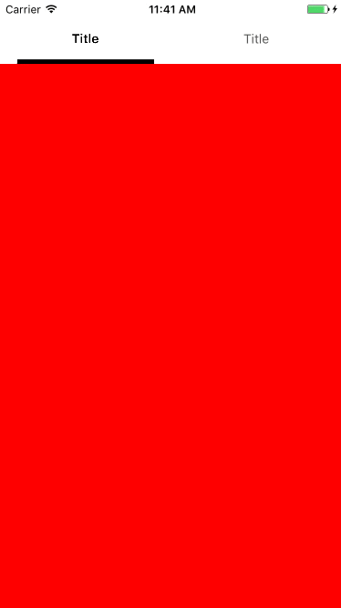

# MultipleTabs

MultipleTabs is a custom iOS component to handle tabs navigation as android Tabs component. It's fully developped in swift but can also be used in ObjC.


https://material.io/guidelines/components/tabs.html



## How To Get Started

Download MultipleTabs and try out the included iPhone/iPad example app.

Check out the documentation for a comprehensive look at all of the functionalities available in MultipleTabs.

MultipleTabs doesn't contain any external dependencies.

### Installation with CocoaPods

CocoaPods is a dependency manager for Objective-C/Swift, which automates and simplifies the process of using 3rd-party libraries like Alamofire in your projects. See the "Getting Started" guide for more information.

http://guides.cocoapods.org/using/getting-started.html

Podfile

```pod "MultipleTabs"```

### Installation with Carthage

https://github.com/Carthage/Carthage

```github "PagesJaunesMobile/MultipleTabs"```

### Other installation 

Git clone the source.

Add MultipleTabs folder to your project (or workspace).

## Quick start

Import the framework :

```import MultipleTabs```

Create a new class and inherit from MultipleTabsViewController :

```class ViewController: MultipleTabsViewController {```

In viewDidLoad register the collectionViewCells you will use for each tab, and declare your dataSource `MultipleTabsViewControllerDataSource` :

```
	override func viewDidLoad() {
    	super.viewDidLoad()
    
    	register(type: Cell1.self, identifier: "Cell1")
    	register(type: Cell2.self, identifier: "Cell2")
    	dataSource = self
  	}
```

The dataSource should implement 3 callbacks method :

```
	/// The number of tabs you want
	func numberOfTabs() -> Int {
    	return 2
  	}
  
  	/// The title for each tab
  	func title(forTabIndex index: Int) -> String {
    	return "Title"
  	}
  
 	/// Return the container cell you want for the tabIndex
 	func cell(forTabIndex index: Int) -> UICollectionViewCell {

    	let cell: UICollectionViewCell
    
    	if index == 0 {
      		cell = dequeue(identifier: "Cell1", index: index)
    	}
    	else {
      		cell = dequeue(identifier: "Cell2", index: index)
    	}
    
    	return cell
  	}

```

### Customization

Some customization are available but all of them comes with default values :

```
  /// The height for the titles bar
  public var titlesHeight: CGFloat = 50
  
  /// The color for the bottom selected border of the tab
  public var titleBorderColor: UIColor = .black
  
  /// The height for the bottom selected border of the tab
  public var titleBorderHeight: CGFloat = 5
  
  /// The color for the title label when selected
  public var titleSelectedColor: UIColor = .black
  
  /// The color for the title label when unselected
  public var titleUnselectedColor: UIColor = .darkGray
  
  /// The font for the title label when selected
  public var titleSelectedFont: UIFont = .boldSystemFont(ofSize: 14)
  
  /// The font for the title label when unselected
  public var titleUnselectedFont: UIFont = .systemFont(ofSize: 14)
  
  /// The multiplier for the size of the bottom selected border compared of the width of the tab title
  public var borderWidthMultiplier: CGFloat = 0.8
```

### Others

Some other dataSource callback are available :

```
  /// Called just before cell will be displayed
  @objc optional func willDisplay(cell: UICollectionViewCell, forTabIndex index: Int)
  
  /// Called just after cell has been displayed
  @objc optional func didEndDisplaying(cell: UICollectionViewCell, forTabIndex index: Int)
```

## Requirements

- MultipleTabs is compatible with iOS 9 and upwards. 
- MultipleTabs uses automatic reference counting (ARC).
- The demo app included with the source requires iOS 9.

## Support

MultipleTabs is provided open source with no warranty and no guarantee of support. However, best effort is made to address issues raised on Github.

If you would like assistance with integrating MultipleTabs or modifying it for your needs, contact the author Xavier De Koninck xavier.dekoninck@gmail.com for consulting opportunities.

## License

MultipleTabs is Copyright (c) 2017 PagesJaunes SA and released open source under a MIT license :

```
Permission is hereby granted, free of charge, to any person obtaining a copy of this software
and associated documentation files (the "Software"), to deal
in the Software without restriction, including without limitation the rights
to use, copy, modify, merge, publish, distribute, sublicense, and/or sell
copies of the Software, and to permit persons to whom the Software is
furnished to do so, subject to the following conditions:

The above copyright notice and this permission notice shall be included in
all copies or substantial portions of the Software.

THE SOFTWARE IS PROVIDED "AS IS", WITHOUT WARRANTY OF ANY KIND, EXPRESS OR
IMPLIED, INCLUDING BUT NOT LIMITED TO THE WARRANTIES OF MERCHANTABILITY,
FITNESS FOR A PARTICULAR PURPOSE AND NONINFRINGEMENT. IN NO EVENT SHALL THE
AUTHORS OR COPYRIGHT HOLDERS BE LIABLE FOR ANY CLAIM, DAMAGES OR OTHER
LIABILITY, WHETHER IN AN ACTION OF CONTRACT, TORT OR OTHERWISE, ARISING FROM,
OUT OF OR IN CONNECTION WITH THE SOFTWARE OR THE USE OR OTHER DEALINGS IN
THE SOFTWARE.
```